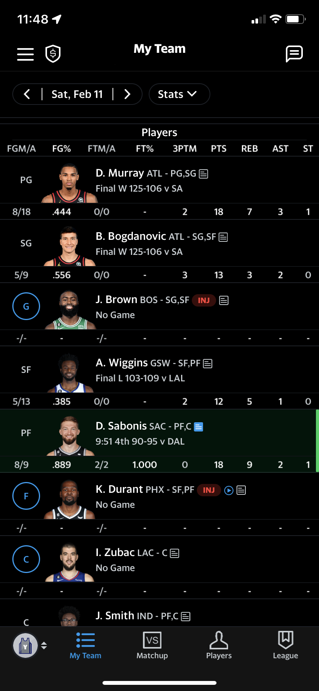

### Danny-AInge
Legendary NBA GM powered by machine learning! Predicts NBA stats and manages your Yahoo Fantasy Basketball team.

# Overview 
Danny AI-nge is trained on . Additional data will be scrapped from [Basketball Reference](https://www.basketball-reference.com/).

Danny-AInge
## [ESPN Fantasy Basketball](https://www.espn.com/fantasy/mens-basketball/)
In ESPN Fantasy Basketball, 4-20 people compete to manage their own NBA rosters where real life NBA games impact the outcome of the fantasy basketball league. Although you may draft players from different teams, there are limitations to make the game more interesting. 

Each starting roster is limited to one player for each NBA position, 2 flex slots called guard(PG,SG) and forward(SF,PF) and three additional UTL slots that can slot in players despite their position. Three additional spots are available for players on the bench. In case of player injury, the injured player may be moved to the IR(Injury reserves) and another player can be added to the roster until the injured player is healthy and gets removed from the IR. Stats earned by bench players and IR players will not be counted. 

A Fantasy Basketball league can be adjusted to work off of different scoring formats. Here's the formats used by ESPN. 

# Rotisserie
Teams are ranked from first to last in each statistical category over the course of the season. Points are then awarded according to the order in each category, and totaled to determine an overall score and league rank. Typically, these leagues cap the total amount of games played at 82 at each position to ensure that no manager can play more games than the rest.

# Head-to-head: Points
This format should be familiar, because it's similar to the way fantasy football is played. It allows you to assign a given point value to individual statistical categories, and each scoring period's winner is determined solely by which team accumulates the most fantasy points versus a single opponent. At the end of the week, you earn either a win, loss or tie before moving on to your next opponent.

# Head-to-head: Each Category
Each week, the totals of each stat category are accumulated and your team is awarded a win, loss or tie based on how it did against your opponent. By the end of the week, you will have a record that reflects your performance (i.e., 6-3-1 in a 10-category league).

# Head-to-Head: Most Categories
This format is similar to Head-to-head: Each category, with one big exception. Every week, the team totals are accumulated in each of the categories for both you and your opponent. Here's where things are different: At the end of the week, a winner is determined by which team wins the most number of categories. The end result is a win (1-0-0), loss (0-1-0) or tie (0-0-1).

# Total Season Points
Points-based scoring allows you to assign a given point value to each individual statistical category (i.e. assist = 2 points, rebounds = 1 point, etc.) Standings are based on the accumulation of points covering all statistical categories and combined into one total points column. The team with the most overall points for the season wins.

## Features
Danny AInge will initially have its features implemented for Head-to-head: Each Category and Head-to-Head: Most Categories. 

Machine learning algorithms will be used to predict the stats of your team's players, the opposing team's players, and the top 20 available player's statistics. 

# Statistics Tracked
- FG%(Field Goal %) 
- FT%(Free Throw %) 
- 3PM(Three Pointers Made)
- REB(Rebounds)
- AST(Assists)
- STL(Steals)
- BLK(Blocks)
- PTS(Points)

Suggestions for your roster will be made, including players to dropp and add, and which players to start on your roster.

## Stack

# Backend
- Node JS
- SQLite
- Tensorflow
- GraphQL
- Express JS

- TypeScript
- NextJS
- TailwindCSS
- SASS

## Demo
WIP 